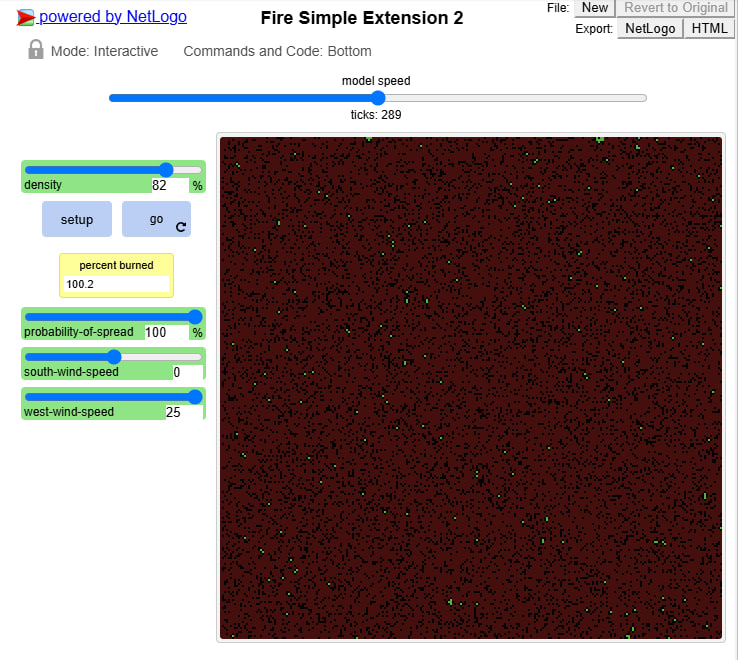
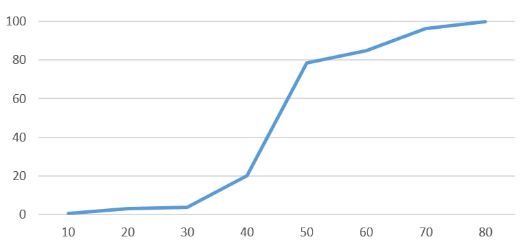
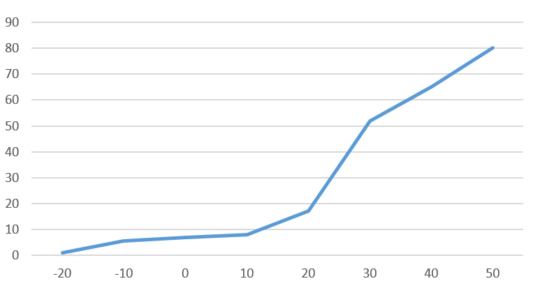

## Комп'ютерні системи імітаційного моделювання
## СПм-23-3, **Ілларіонов Максим Юрійович**
### Лабораторна робота №**1**. Опис імітаційних моделей та проведення обчислювальних експериментів

 

### Варіант 5, модель у середовищі NetLogo:
[Fire Simple Extension 2](http://www.netlogoweb.org/launch#http://www.netlogoweb.org/assets/modelslib/IABM%20Textbook/chapter%203/Fire%20Extensions/Fire%20Simple%20Extension%202.nlogo)

 

### Вербальний опис моделі:
Симуляція поширення вогню через ліс. Вогонь стартує з лівого (західного) краю відповідно до термінології програми та поширюється в протилежному напрямку, керуючись встановленими правилами та параметрами. Кожна осередок вогню має ймовірність перекинутися на сусідні клітини лісу. Щільність лісу визначається на початку симуляції, а ймовірність поширення залежить від відповідного параметра та напрямків вітру.

### Керуючі параметри:
- **density** задає густоту засадження території деревами.
- **probability of spread** встановлює початкову ймовірність поширення вогню на сусідні клітинки.
- **south-wind-speed** регулює швидкість південного вітру.
- **west-wind-speed** визначає швидкість західного вітру.

### Внутрішні параметри:
- **initial-trees**. Початкова кількість дерев у момент запуску програми.

### Показники роботи системи:
 Частка згорілих дерев у відсотках.

 ### Недоліки моделі:
 Малий розмір обраного поля значно впливає на репрезентативність досліджень. Деякі налаштування вітру можуть повністю блокувати поширення вогню на певні сусідні клітини, що не відображає реальних умов. Швидкість вітру має обмежену конфігурацію.

На малюнку показано некоректну поведінку під час обчислення кінцевої кількості згорілих дерев.
 

## Обчислювальні експерименти

### 1. Вплив вірогідності розповсюдження вогню на кінцеву кількість спалених дерев

Досліджується залежність кінцевого показника згорілих дерев від ймовірності поширення вогню. Завершення симуляції визначається кількістю тактів.
Експерименти проводяться при 20-90 відсодках вірогідності, з кроком 10, усього 8 симуляцій.  
Експерименти виконуються при ймовірності поширення вогню від 10-80, з кроком у 10, всього 7 симуляцій.
Інші керуючі параметри встановлені на значення за замовчуванням.
- **density**: 80
- **south-wind-speed**: 15
- **west-wind-speed**: 10

<table>
<thead>
<tr><th>Вірогідність розповсюдження</th> <th>Відсоток згорівших дерев</th></tr>
</thead>
<tbody>
<tr><td>10</td><td>0.6</td></tr>
<tr><td>20</td><td>3</td></tr>
<tr><td>30</td><td>3.7</td></tr>
<tr><td>40</td><td>20</td></tr>
<tr><td>50</td><td>78.5</td></tr>
<tr><td>60</td><td>84.8</td></tr>
<tr><td>70</td><td>96.2</td></tr>
<tr><td>80</td><td>99.7</td></tr>
</tbody>
</table>

 

Графік наочно демонструє, що кінцева кількість згорілих дерев залежить від того, чи перевищує ймовірність розповсюдження 55%. Чим вища ймовірність (більше 55%), тим критичніше це впливає на кількість згорілих дерев.

### 2. Перевірка гіпотези, що швидкість вітру може мати критичний вплив на кінцеву кількість згорілих дерев.
 
Досліджується гіпотеза, що швидкість вітру може значно вплинути на кінцеву кількість згорілих дерев на полі. Кінець симуляції визначається кількістю тактів. Експерименти проводяться при значеннях сили західного вітру -20 та 50 одиниць з кроком 10, всього 8 симуляцій.

Інші керуючі параметри мають значення за замовчуванням:
- **probability-of-spread**: 60
- **south-wind-speed**: 0
- **density**: 80

<table>
<thead>
<tr><th>Швидкість західного вітру</th> <th>Відсоток згорівших дерев</th></tr>
</thead>
<tbody>
<tr><td>-20</td><td>1</td></tr>
<tr><td>-10</td><td>5.7</td></tr>
<tr><td>0</td><td>7</td></tr>
<tr><td>10</td><td>8.1</td></tr>
<tr><td>20</td><td>17.2</td></tr>
<tr><td>30</td><td>52</td></tr>
<tr><td>40</td><td>65</td></tr>
<tr><td>50</td><td>80.2</td></tr>
</tbody>
</table>

Графік наочно демонструє, що при певній конфігурації сила вітру може мати критичний вплив на поширення вогню та, відповідно, на кінцеву кількість згорілих дерев.

### 3. Вибір мінімальної dencity достатньої для повного знищення лісу вогнем.
 
Досліджується можливість налаштування, яке призведе до 100% згоряння дерев, і визначається мінімальна щільність лісу, що забезпечує таку умову. Експеримент триває, поки не буде знайдено мінімальний показник щільності, при якому відбувається повне знищення вогнем. Регулюється параметр щільності (dencity).

Інші керуючі параметри мають значення за замовчуванням:
- **probability-of-spread**: 100
- **south-wind-speed**: 0
- **west-wind-speed**: 15

 <table>
<thead>
<tr><th>Щільність лісу</th> <th>Відсоток згорівших дерев</th></tr>
</thead>
<tbody>
<tr><td>20</td><td>1.2</td></tr>
<tr><td>30</td><td>3</td></tr>
<tr><td>40</td><td>6.4</td></tr>
<tr><td>50</td><td>56.3</td></tr>
<tr><td>60</td><td>74</td></tr>
<tr><td>75</td><td>100</td></tr>
<tr><td>68</td><td>98.6</td></tr>
</tbody>
</table>

 

За результатами досліджень встановлено, що мінімальна щільність дерев, яка призводить до повного згоряння, становить 75%. 